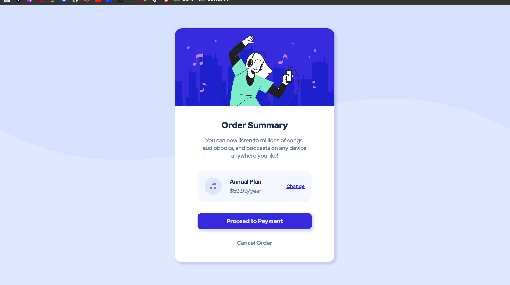
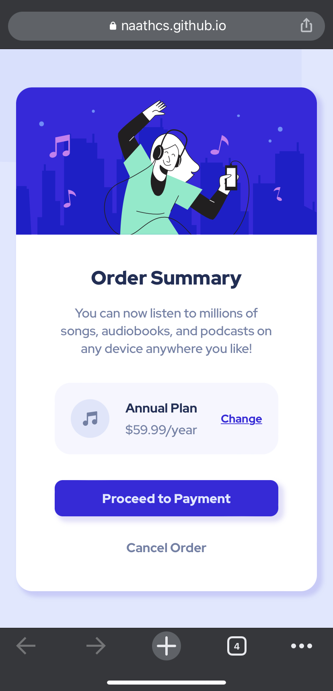

# Frontend Mentor - Order summary card solution

This is a solution to the [Order summary card challenge on Frontend Mentor](https://www.frontendmentor.io/challenges/order-summary-component-QlPmajDUj). Frontend Mentor challenges help you improve your coding skills by building realistic projects.

## Table of contents

- [Overview](#overview)
  - [The challenge](#the-challenge)
  - [Screenshot](#screenshot)
  - [Links](#links)
- [My process](#my-process)
  - [Built with](#built-with)
  - [What I learned](#what-i-learned)
  - [Useful resources](#useful-resources)
- [Author](#author)

## Overview

### The challenge

Users should be able to:

- See hover states for interactive elements.
- Each link is interactive and will send the user to a different link.

### Screenshot

### Links

- Solution URL: [Github Code](https://github.com/naathcs/Order-Summary-Component)
- Live Site URL: [Github Pages](https://naathcs.github.io/Order-Summary-Component/)

## My process

I started creating div elements in the index file and organizing it as to be as close as possible to the designs provided. Adding links to the CSS file and the fonts used (Google Fonts).

Commented sections on the index.html and styles.css files to separate each section.

I created classes for almost every piece of the html file so it would be easier to create properties in the CSS file and modify the view. Most of the CSS file was pretty easy to develop (which makes me really happy - it means I'm getting better) but at some point I got stuck because instead of using anchor throughout all the links in the challenge, I created buttons, then changed to input, so it was very confusing to add CSS to all those different tags. And since each tag behaves different with the same CSS file, it took me some time to find out the problem. After requesting help in the [FrontendMentor](https://www.frontendmentor.io/) Slack community, I got some feedback on what it would be the best approach to finish the challenge, along with things to change/remove/add that I haven't noticed in the code.

First, I added a CSS reset file to reset all the standard values that pages usually have, this way it wouldn't interfere in any changes I was making. Second, I changed most values from percentage ( % ) to px or rem, it was making most areas and sizes weird looking.
I was also using several unnecessary media queries, so I deleted and left just the necessary one. Changed all the links and turned into anchors, which made it easier to modify using classes and CSS.
I had two H1 tags so I changed that, the text was wrapped in a div that was not being used, so were the buttons, so I got rid of them.
Last I checked the `:hover` effects and every anchor tag has a link that will send the user to a different link or back to the main page.
I also added height in vh `viewport height` unit so the vertical align would work.

### Built with

- Semantic HTML5 markup
- CSS custom properties
- Flexbox
- Mobile-first workflow
- CSS Media Query

### What I learned

reset css file
buttons can be created out of anchors instead of buttons or inputs
used viewport height to center the card

This challenge taught me to keep the process simple. It's not necessary to add a crazy amount of thing to make it look fancy or complicated when what I need to do is get to point in a simple and effective way.
I learned to use CSS reset file, which I have never heard until the Slack community mentioned. Also, I mixed anchor tag with input tag with a button tag which didn't make any sense and made the whole development more complicated. As previously said, I used height in `vh: viewport height` unit, which helped use 100% of the screen and position the card the way I was expectiong to.

### Useful resources

- [CSS Reset](https://www.digitalocean.com/community/tutorials/css-minimal-css-reset) - This page helped understand how to use the CSS reset file, and also gave me examples on how to use it.
- [max-width Documentation](https://developer.mozilla.org/en-US/docs/Web/CSS/max-width) - This documentation gave me some clarity on how the max-width works and how to use it.
- [Viewport Height](https://www.freecodecamp.org/news/html-page-width-height/) - This page page gave different examples of how to set a full page width and height. This is where I saw the `vh` unit and decided to look into it.
- [Viewport Concept](https://developer.mozilla.org/en-US/docs/Web/CSS/Viewport_concepts) - This page gives you the concept of viewport and when and where is best to use it.
- [CSS Alignment](https://medium.com/12-developer-labors/css-all-the-ways-to-align-elements-left-and-right-52ecce4a4af9) - This page helped to see the different ways to align an object and helped me figure it out the best one to use it.

## Author

- Website - [Github](https://github.com/naathcs)
- Frontend Mentor - [@naathcs](https://www.frontendmentor.io/profile/naathcs)
- Twitter - [@csnaath](https://twitter.com/csnaath)
- Instagram - [@naath.cs](https://instagram.com/naath.cs)
